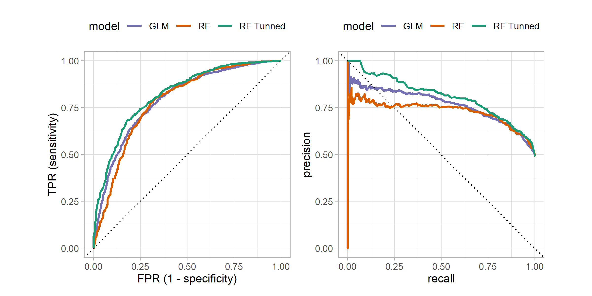
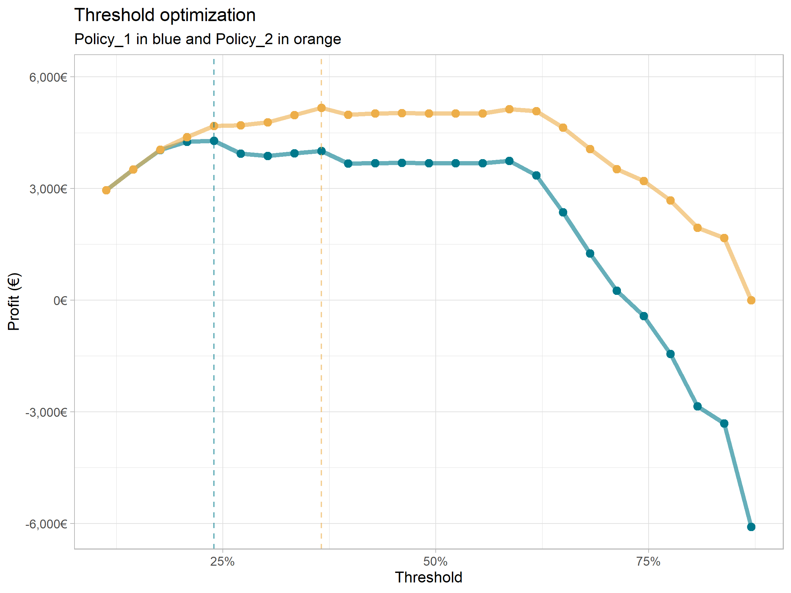

# Glovo couriers

 This assignment consist of three phases, exploratory analysis and data munging, create a predictive algorithm and model evaluation.

-   Two datasets have been provided, one with weekly data from 759 couriers and the other one with life time data from 7524 couriers.

-   Multiple analysis has been made in order to understand the data and try to discover what the meaning of each variable is.

-   Different methodologies has been used to impute the missing values, going from mean imputation to a kNN's.

-   A GLM and Random forest models have been trained on this dataset, achieving an ROC of 0.82 and 0.78 respectively. In order to find the best probability cutoff, threshold optimization has been made.

-   An small business case has been done in order to justify why this threshold has been selected.

## Exploratory analysis

You can find all the analysis, tables and models in the notebook `notebooks/global_report.Rmd` document. 

The analysis starts analyzing the proportions of the target, then looking at the distributions of the variables and the relationships between them. During this exploratory analysis we have found that some variables are highly correlated.

<p align="center">
  
</p>

From a business perspective, the retention rate might be an interesting measure to look at. Looking at the retention rate we can see how long the couriers stay with us and when most of them leave.

<p align="center">
  
</p>

## Training

We have created two models (glm and random forest) to predict the likelihood of stay or leave of the couriers. Then, we look for the best hyper-parameter of this model.

<p align="center">
  
</p>

Once the model is chosen, an small business case is carried out to justify the selection of the target and see what's the impact of the model.

<p align="center">
  
</p>

## Setup 🚀

Install the latest development version of `renv` with:

```r
if (!requireNamespace("remotes"))
  install.packages("remotes")

remotes::install_github("rstudio/renv")
```

Initialize a new project-local environment with a private R library.

```r
renv::init()
```

Install all the packages declared in the lockfile (`renv.lock`)

```r
renv::restore()
```

## Contact ✒️

Carlos Espeleta - @Carlos_Espeleta

LinkedIn: https://www.linkedin.com/in/carlos-espeleta
